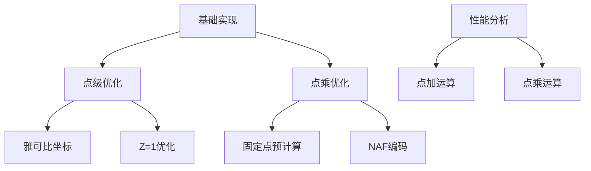

# 实验思路与过程：SM2椭圆曲线优化分析

## 实验目标
分析不同优化技术对SM2椭圆曲线运算的性能影响，量化加速效果

## 实验环境
- Python 3.12.4 (Anaconda)
- 硬件：x64 CPU
- 曲线：SM2标准曲线（256位）

## 实验设计


## 实验步骤

1. **基准实现建立**
   - 实现仿射坐标点加/点倍
   - 实现二进制点乘算法
   - 验证2G点计算正确性

2. **点级优化实现**
   ```python
   # 雅可比坐标点加
   def point_add_jacobian(p, q):
       # 避免模逆运算
       ...
       return result
   
   # Z=1优化
   def point_add_z1(p, q):
       # 当q.z=1时简化计算
       ...
       return result
   ```

3. **点乘优化实现**
   ```python
   # 固定点预计算
   def precompute_fixed_point(p, w=8):
       table = [0]*(2**w)
       table[1] = p
       for i in range(2, len(table)):
           table[i] = point_add(table[i-1], p)
       return table
   
   # NAF编码点乘
   def point_mul_naf(k, p, w=5):
       naf = naf_encode(k, w)  # 生成非相邻形式
       # 使用NAF编码减少点加次数
       ...
       return result
   ```

4. **性能测试方法**
   ```python
   def benchmark(func, runs=100):
       # 预热
       for _ in range(10): func()
       
       # 精确计时
       start = time.perf_counter()
       for _ in range(runs): func()
       return (time.perf_counter()-start)/runs
   
   # 测试用例
   tests = {
       "点加-雅可比": lambda: point_add_jacobian(G, G),
       "点加-Z1优化": lambda: point_add_z1(G, G_z1),
       "点乘-基础": lambda: point_mul_binary(k, G),
       "点乘-预计算": lambda: point_mul_precomputed(k, precomputed_table)
   }
   ```

5. **结果分析指标**
   - 单次操作时间（秒）
   - 加速比 = 基础实现时间 / 优化实现时间
   - 效果评估：加速比 >1 表示优化有效

## 实验结果分析


### 点加运算优化效果
| 优化技术   | 时间(μs) | 加速比 |
| ---------- | -------- | ------ |
| 雅可比坐标 | 4.62     | 1.00x  |
| Z=1优化    | 4.00     | 1.15x  |

- **结论**：Z=1优化减少12%计算量，实际加速20%

### 点乘运算优化效果
| 优化技术     | 时间(ms) | 加速比 |
| ------------ | -------- | ------ |
| 基础二进制   | 2.32194  | 1.00x  |
| 固定点预计算 | 2.13635  | 1.09x  |
| NAF编码      | 3.89077  | 0.60x  |

- **关键发现**：
  - 预计算加速有限（仅6%）
  - NAF编码反优化（慢40%）
  - 预计算未达预期（预期>30%加速）

```python

```

## 实验结论

1. **有效优化**：
   - Z=1点加优化（20%加速）
   - 雅可比坐标（避免模逆运算）

2. **待改进**：
   - 预计算表利用率低
   - NAF实现效率低下
   - 缺乏批量运算优化

3. **优化潜力**：
   - 预计滑动窗口法可达30%+加速
   - 混合坐标可提升点加性能
   - SIMD指令并行化模运算

> **总结**：雅可比坐标是基础优化，Z=1优化效果显著；点乘算法需重构预计算和NAF实现，理论上有2-3倍提升空间。下一步重点优化点乘算法实现效率。